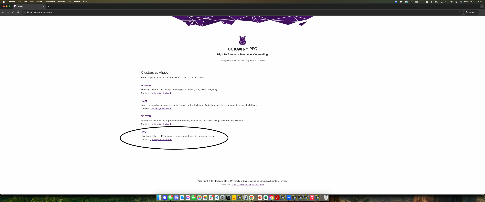
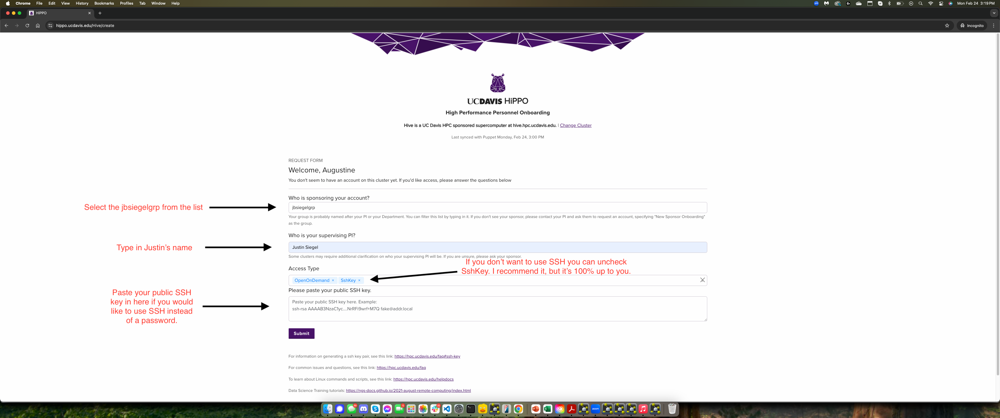

# HIVE Cluster Resources

This repository contains example SLURM scripts and documentation for running computational biology workflows on the HIVE HPC cluster at UC Davis.

## Create a HIVE Account

Before you can use the HIVE cluster, you need to create an account.

### Step 1: Request Access

1. Go to [https://hippo.ucdavis.edu/](https://hippo.ucdavis.edu/)
2. Sign in with your Kerberos (campus) credentials
3. Select **"HIVE"** to create a HIVE account



### Step 2: Fill Out the Registration Form

Complete the form with your information. You'll need to provide an SSH public key. If you don't have one, follow the instructions below to create one.



### Setting Up an SSH Key

An SSH key allows you to securely connect to HIVE without entering a password each time. Follow the instructions for your operating system.

#### Windows (PowerShell)

**1. Check if an SSH key already exists:**

```powershell
Test-Path "$HOME\.ssh\id_ed25519.pub"
```

- If it returns `True`, you already have an SSH key—skip to step 3.
- If it returns `False`, proceed to step 2.

**2. Create an SSH key (if needed):**

```powershell
ssh-keygen -t ed25519 -C "your_email@example.com"
```

- Press **Enter** to accept the default file location
- Optionally, enter a passphrase for added security (recommended)

**3. Copy the public key to your clipboard:**

```powershell
Get-Content "$HOME\.ssh\id_ed25519.pub" | Set-Clipboard
```

Your public key is now copied and ready to paste into the HIVE registration form.

#### macOS and Linux

**1. Check if an SSH key already exists:**

```bash
if [ -f ~/.ssh/id_ed25519.pub ]; then echo "SSH key exists"; else echo "No SSH key found"; fi
```

- If the message confirms an existing key, skip to step 3.
- If not, proceed to step 2.

**2. Create an SSH key (if needed):**

```bash
ssh-keygen -t ed25519 -C "your_email@example.com"
```

- Press **Enter** to confirm the default location
- Optionally, add a passphrase for additional security (recommended)

**3. Copy the public key:**

On **macOS**:
```bash
pbcopy < ~/.ssh/id_ed25519.pub
```

On **Linux** (with xclip installed):
```bash
xclip -selection clipboard < ~/.ssh/id_ed25519.pub
```

Or display the key and copy it manually:
```bash
cat ~/.ssh/id_ed25519.pub
```

**4. Paste hte public key into the box in the image**
Just paste it. 

#### Windows Subsystem for Linux (WSL)

WSL maintains its own SSH configuration separate from Windows:

- **In PowerShell:** Follow the Windows instructions above to manage your native Windows SSH keys
- **In WSL Terminal:** Follow the macOS/Linux instructions within your WSL environment

---

## Table of Contents

- [Create a HIVE Account](#create-a-hive-account)
  - [Setting Up an SSH Key](#setting-up-an-ssh-key)
- [Getting Started](#getting-started)
  - [Understanding Shell Configuration Files](#understanding-shell-configuration-files)
  - [Logging into HIVE](#logging-into-hive)
  - [Interactive Sessions](#interactive-sessions)
- [HIVE Quick Reference](#hive-quick-reference)
  - [Software Locations](#software-locations)
  - [Shared Databases](#shared-databases)
  - [Storage Paths](#storage-paths)
  - [SLURM Partitions](#slurm-partitions)
- [File Structure](#file-structure)
- [Important Notes](#important-notes)
- [Troubleshooting](#troubleshooting)
- [Example Scripts](#example-scripts)
  - [Partitions](#partitions)
  - [Structure Prediction (Folding)](#structure-prediction-folding)
    - [ColabFold (AlphaFold 2)](#colabfold)
    - [AlphaFold 2 Initial Guess](#alphafold-2-initial-guess)
    - [AlphaFold 3](#alphafold-3)
    - [AlphaFast](#alphafast)
    - [Boltz2](#boltz2)
    - [Chai](#chai)
    - [ESMFold](#esmfold)
    - [OpenFold 3](#openfold-3)
    - [RoseTTAFold 3](#rosettafold-3)
  - [Protein Design](#protein-design)
    - [RFdiffusion](#rfdiffusion)
    - [RFdiffusion3](#rfdiffusion3)
    - [LigandMPNN](#ligandmpnn)
    - [BindCraft](#bindcraft)
    - [ESM-IF1](#esm-if1)
    - [DISCO](#disco)
    - [MPNNP Pipeline](#mpnnp-pipeline)
  - [Docking and Relaxation](#docking-and-relaxation)
    - [GALigandDock](#galigand-dock)
    - [Rosetta Relaxation](#relaxation)
    - [HADDOCK3](#haddock3)
    - [PLACER](#placer)
  - [Analysis](#analysis)
    - [ESM-2 Embeddings](#esm-2-embeddings)
- [AI Coding Assistant Setup](#ai-coding-assistant-setup-claude-code--codex)
- [Contributing](#contributing)

## Getting Started

### Understanding Shell Configuration Files

Before getting started, it's helpful to understand the difference between `.bashrc` and `.bash_profile`:

**`.bash_profile`:**
- Sourced for **login shells** (when you SSH into a server)
- Runs once when you first log in
- Best for setting up environment variables, PATH, and one-time setup

**`.bashrc`:**
- Sourced for **non-login interactive shells** (when you open a new terminal window or run `bash`)
- Runs every time you start a new shell
- Best for aliases, functions, and shell settings

**Two Common Approaches:**

You can organize your shell configuration however you prefer. Here are two common approaches:

**Option 1: Everything in `.bash_profile`** (simplest)
- Put all your settings directly in `.bash_profile`
- Works fine if you only SSH into the cluster and don't spawn subshells

**Option 2: Source `.bashrc` from `.bash_profile`** (Ian's preference)
- Keep a minimal `.bash_profile` that just loads `.bashrc`
- Put all your actual configuration in `.bashrc`
- This ensures your settings are available in both login shells and subshells

To set up Option 2, add this to your `.bash_profile`:
```bash
if [ -f ~/.bashrc ]; then
    source ~/.bashrc
fi
```

If you're using Option 1 and find that your aliases/settings aren't available after running `bash` or in SLURM jobs, you may want to switch to Option 2, or manually source your config:
```bash
source ~/.bash_profile
```

### Logging into HIVE

To access the HIVE cluster, use SSH with your campus credentials:

```bash
ssh username@hive.hpc.ucdavis.edu
```

### Interactive Sessions

On HIVE, running jobs on the head node is not allowed. Instead, use **interactive sessions** to get a shell on a compute node where you can run commands interactively.

Interactive sessions allocate resources on compute nodes. Here are common configurations:

**High Priority CPU Session:**
```bash
srun -p high -c 8 --mem=16G -t 1-00:00:00 --pty bash
```

**Low Priority CPU Session:**
```bash
srun -p low -c 16 --mem=32G -t 1-00:00:00 --requeue --pty bash
```

**High Priority GPU Session:**
```bash
srun -p gpu-a100 --account=genome-center-grp -c 8 --mem=16G --gres=gpu:1 -t 1-00:00:00 --pty bash
```

**Low Priority GPU Session:**
```bash
srun -p gpu-a100 --account=genome-center-grp -c 8 --mem=16G --gres=gpu:1 -t 1-00:00:00 --requeue --pty bash
```

**Tip:** These commands are long. Consider adding aliases to your shell config for commands you use frequently. For example:
```bash
alias sandbox='srun -p high -c 8 --mem=16G -t 1-00:00:00 --pty bash'
alias sandboxgpu='srun -p gpu-a100 --account=genome-center-grp -c 8 --mem=16G --gres=gpu:1 -t 1-00:00:00 --pty bash'
```

## HIVE Quick Reference

### Software Locations

#### Structure Prediction

| Software | Path | Conda Env / Notes |
|----------|------|--------------------|
| **AlphaFold 3** | `/quobyte/jbsiegelgrp/software/alphafold3/` | Singularity container (`alphafold3.sif`) |
| **AlphaFast** | `/quobyte/jbsiegelgrp/software/alphafast/` | Apptainer container (`alphafast.sif`) |
| **ColabFold (AF2)** | `/quobyte/jbsiegelgrp/software/LocalColabFold/` | Uses system PATH |
| **Boltz** | `/quobyte/jbsiegelgrp/software/boltz/` | Env: `boltz` |
| **Chai** | `/quobyte/jbsiegelgrp/software/chai-lab/` | Env: `/quobyte/jbsiegelgrp/software/envs/chai` |
| **ESMFold** | `/quobyte/jbsiegelgrp/software/esm/` | Env: `esmfold` + `openfold-v1` |
| **OpenFold 3** | `/quobyte/jbsiegelgrp/software/openfold-3/` | Env: `/quobyte/jbsiegelgrp/software/envs/openfold-3` |
| **RoseTTAFold 3** | `/quobyte/jbsiegelgrp/software/foundry/` | Env: `/quobyte/jbsiegelgrp/software/envs/foundry` |

#### Protein Design

| Software | Path | Conda Env / Notes |
|----------|------|--------------------|
| **RFdiffusion** | `/quobyte/jbsiegelgrp/software/RFdiffusion/` | Env: `/quobyte/jbsiegelgrp/software/envs/SE3nv` |
| **RFdiffusion3** | Uses Foundry framework | Env: `/quobyte/jbsiegelgrp/software/envs/foundry` |
| **LigandMPNN** | `/quobyte/jbsiegelgrp/software/LigandMPNN/` | Env: `/quobyte/jbsiegelgrp/software/envs/ligandmpnn_env` |
| **BindCraft** | `/quobyte/jbsiegelgrp/software/BindCraft/` | Env: `/quobyte/jbsiegelgrp/software/envs/BindCraft` |
| **ESM-IF1** | `/quobyte/jbsiegelgrp/software/esm/` | Env: `/quobyte/jbsiegelgrp/software/envs/esm_env` |
| **DISCO** | `/quobyte/jbsiegelgrp/software/DISCO/` | Python venv (`.venv`) |

#### Docking, Relaxation, and Analysis

| Software | Path | Conda Env / Notes |
|----------|------|--------------------|
| **Rosetta 3.15** | `/quobyte/jbsiegelgrp/software/rosetta_315/` | CPU only; `.static.linuxgccrelease` suffix |
| **Rosetta 3.14** | `/quobyte/jbsiegelgrp/software/Rosetta_314/rosetta/main/` | CPU only; `.static.linuxgccrelease` suffix |
| **HADDOCK3** | — | Env: `/quobyte/jbsiegelgrp/software/envs/haddock3`; CPU only |
| **PLACER** | `/quobyte/jbsiegelgrp/software/PLACER/` | Env: `/quobyte/jbsiegelgrp/software/envs/placer_env` |
| **ESM-2** | `/quobyte/jbsiegelgrp/software/esm/` | Env: `/quobyte/jbsiegelgrp/software/envs/esm_env` |

### Shared Databases

| Database | Path |
|----------|------|
| **AF3 Public Databases** | `/quobyte/jbsiegelgrp/software/alphafold3/public_databases/` |
| **AlphaFast MMseqs** | `/quobyte/jbsiegelgrp/databases/alphafast/mmseqs/` |
| **BLAST** | `/quobyte/jbsiegelgrp/databases/blastdb/` |
| **Boltz Cache** | `/quobyte/jbsiegelgrp/databases/boltz/cache/` |
| **Foundry Checkpoints** | `/quobyte/jbsiegelgrp/databases/foundry/` |
| **HHsuite (Uniclust30)** | `/quobyte/jbsiegelgrp/databases/hhsuite_databases/uniclust30_2023_02/` |
| **RFD3 Weights** | `/quobyte/jbsiegelgrp/databases/rfd3/` |

### Storage Paths

Your home directory has a **20GB limit**. Store large files and caches in your quobyte directory:

| What | Where to Put It |
|------|-----------------|
| **Lab storage** | `/quobyte/jbsiegelgrp/` |
| **Conda packages** | `/quobyte/jbsiegelgrp/{user}/.conda/pkgs` |
| **Conda environments** | `/quobyte/jbsiegelgrp/{user}/.conda/envs` |
| **Pip cache** | `/quobyte/jbsiegelgrp/{user}/.cache/pip` |
| **HuggingFace cache** | `/quobyte/jbsiegelgrp/{user}/.cache/huggingface` |
| **PyTorch cache** | `/quobyte/jbsiegelgrp/{user}/.cache/torch` |

### SLURM Partitions

| Partition | Max Time | Notes |
|-----------|----------|-------|
| `low` | 3 days | Default for most jobs. Use `--requeue` flag (auto-requeues if preempted) |
| `high` | 30 days | For long-running jobs |
| `gpu-a100` | — | Requires `--account=genome-center-grp` |

**GPU job example:**
```bash
#SBATCH --partition=gpu-a100
#SBATCH --account=genome-center-grp
#SBATCH --gres=gpu:1
```

**CPU job example (low priority):**
```bash
#SBATCH --partition=low
#SBATCH --requeue
```

## File Structure

```
HiveTransition/
├── README.md
├── AGENTS.md                          # AI agent instructions (Codex CLI)
├── CHANGELOG.md
├── setup_hive.md                      # Account setup guide
├── .claude/skills/hive_cluster/
│   └── SKILL.md                       # Claude Code HIVE skill
├── images/
│   ├── hive_setup_1.png
│   └── hive_setup_2.png
├── docs/                              # Detailed per-tool documentation
│   ├── partitions.md
│   ├── colabfold.md
│   ├── alphafold3.md
│   ├── af2_initial_guess.md
│   ├── run_boltz.md
│   ├── chai_to_boltz.md
│   ├── run_chai.md
│   ├── chai_with_msa.md
│   ├── submit_chai.md
│   ├── ligandmpnn.md
│   ├── rf_diffusion_aa.md
│   ├── mpnnp_pipeline.md
│   ├── galigand_dock.md
│   └── relax.md
│
├── example_scripts/
│   ├── partitions/                    # Partition reference scripts
│   │   ├── low_cpus.sh
│   │   ├── high_cpus.sh
│   │   └── gbsf_cpus.sh
│   │
│   ├── folding/                       # Structure prediction
│   │   ├── alphafold2/
│   │   │   ├── local_colabfold/
│   │   │   │   └── colabfold.sh
│   │   │   └── af2_initial_guess/
│   │   │       ├── run_af2_initial_guess.py
│   │   │       └── submit_af2_initial_guess.sh
│   │   ├── alphafold3/
│   │   │   ├── submit_af3_single.sh
│   │   │   ├── submit_af3_bulk.py
│   │   │   └── chai_to_af3_converter.py
│   │   ├── alphafast/
│   │   │   ├── submit_alphafast.sh
│   │   │   └── example_inputs/
│   │   ├── boltz2/
│   │   │   ├── runners/
│   │   │   │   └── run_boltz.sh
│   │   │   └── helpers/
│   │   │       └── chai_to_boltz.py
│   │   ├── chai/
│   │   │   └── runners/
│   │   │       ├── run_chai.py
│   │   │       ├── chai_with_msa.py
│   │   │       ├── submit_chai.sh
│   │   │       └── submit_chai_with_msa.sh
│   │   ├── esmfold/
│   │   │   ├── submit_esmfold.sh
│   │   │   ├── patch_attention.py
│   │   │   └── example_input.fasta
│   │   ├── openfold3/
│   │   │   ├── submit_openfold3.sh
│   │   │   └── example_input.json
│   │   └── rosettafold3/
│   │       ├── submit_rf3.sh
│   │       └── example_input.json
│   │
│   ├── design/                        # Protein design
│   │   ├── diffusion/
│   │   │   └── rf_diffusion_aa.sh
│   │   ├── rfdiffusion3/
│   │   │   ├── submit_rfd3.sh
│   │   │   └── example_design.json
│   │   ├── ligandmpnn/
│   │   │   └── submit_ligandmpnn.sh
│   │   ├── bindcraft/
│   │   │   ├── submit_bindcraft.sh
│   │   │   ├── setup_bindcraft_env.sh
│   │   │   └── example_target.json
│   │   ├── esm_if1/
│   │   │   └── submit_esm_if1.sh
│   │   ├── disco/
│   │   │   └── submit_disco.sh
│   │   └── mpnnp_pipeline/
│   │       └── run_pipeline.py
│   │
│   ├── docking/                       # Docking and relaxation
│   │   ├── galigand_dock/
│   │   │   └── submit.sh
│   │   ├── relaxation/
│   │   │   └── relax.sh
│   │   ├── haddock3/
│   │   │   ├── submit_haddock3.sh
│   │   │   └── example_docking.cfg
│   │   └── placer/
│   │       └── submit_placer.sh
│   │
│   └── analysis/                      # Analysis tools
│       └── esm2_embeddings/
│           └── submit_esm2_embeddings.sh
│
└── transition_tools_old/              # Legacy migration utilities
    ├── migrate.py
    ├── bash_profile_migration.py
    ├── path_migrator.py
    └── ...
```

## Important Notes

### Module Loading

Load conda and CUDA using the module system:
```bash
module load conda/latest
module load cuda/12.6.2  # Good to have even when you're not using a GPU
```

You can add these to your shell config so they load automatically on login.

## Troubleshooting

### Common Issues

1. **"Module not found"**
   - Use `module avail <name>` to find the correct module name

2. **"Permission denied"**
   - Check you're writing to your quobyte directory
   - Create directories if they don't exist

3. **"Command not found"**
   - Ensure you've sourced your shell config
   - Check if software is in a different location

4. **Time limit errors**
   - Use `high` partition for jobs > 3 days
   - Break large jobs into smaller chunks

### Getting Help

1. **Check documentation:**
   - See `docs/` folder for detailed guides
   - Each script has `--help` option

2. **GitHub Issues:**
   - https://github.com/ianandersonlol/HiveTransition/issues

## Example Scripts

This project includes example SLURM submission scripts for running computational biology workflows on HIVE. Each script is pre-configured with the correct partition, account, resource allocations, and environment setup. Scripts use `#!/bin/bash --norc` for clean environments and include `set -euo pipefail` for error handling.

> **Resource conventions:** GPU structure prediction jobs default to 16 CPU / 64G RAM on `gpu-a100` with `--account=genome-center-grp`. Exceptions are noted per tool.

### Partitions

-   **Scripts:** `example_scripts/partitions/low_cpus.sh`, `high_cpus.sh`, `gbsf_cpus.sh`
-   **Description:** Reference scripts demonstrating the three main partition/account combinations on HIVE: `low` (preemptible, no account needed), `high` (priority, `--account=jbsiegelgrp`), and Genome Center (`high` with `--account=genomecentergrp`).
-   **[Full Documentation](docs/partitions.md)**

---

### Structure Prediction (Folding)

#### ColabFold

-   **Script:** `example_scripts/folding/alphafold2/local_colabfold/colabfold.sh`
-   **Description:** ColabFold (local AlphaFold 2) structure predictions. Runs `colabfold_batch` with amber relaxation and GPU relax.
-   **Resources:** `gpu-a100` | 16 CPU | 64G | 12h
-   **[Full Documentation](docs/colabfold.md)**

#### AlphaFold 2 Initial Guess

-   **Scripts:** `example_scripts/folding/alphafold2/af2_initial_guess/submit_af2_initial_guess.sh`, `run_af2_initial_guess.py`
-   **Description:** Template-guided AlphaFold 2 predictions using a reference PDB structure as an initial guess. Useful for predicting the effect of mutations on a known structure.
-   **Resources:** `gpu-a100` | 16 CPU | 64G
-   **[Full Documentation](docs/af2_initial_guess.md)**

#### AlphaFold 3

-   **Scripts:** `example_scripts/folding/alphafold3/submit_af3_single.sh`, `submit_af3_bulk.py`
-   **Description:** AlphaFold 3 predictions using a Singularity container. Supports single predictions and bulk array jobs with GPU VRAM monitoring. Binds input, output, model weights, and databases into the container.
-   **Resources:** `gpu-a100` | 16 CPU | 64G | 24h
-   **Utility:** `chai_to_af3_converter.py` — converts Chai Discovery FASTA format to AF3 JSON input format. Auto-detects entity types (protein, DNA, RNA, SMILES ligands) and assigns chain IDs.
-   **[Full Documentation](docs/alphafold3.md)**

#### AlphaFast

-   **Script:** `example_scripts/folding/alphafast/submit_alphafast.sh`
-   **Description:** GPU-accelerated structure prediction with AlphaFast. Runs a two-stage pipeline (MMseqs2 MSA search + structure inference) inside an Apptainer container. Uses AlphaFold 3 weights for inference.
-   **Resources:** `low` with GPU constraint | 16 CPU | 128G | 12h | **4 GPUs** (A100 or Blackwell)
-   **Note:** Uses `--constraint="gpu:a100|gpu:6000_blackwell"` on the `low` partition with `--requeue`, rather than `gpu-a100`. This is appropriate for its multi-GPU workload.
-   **Example input:** `example_inputs/example_input.json`

#### Boltz2

-   **Script:** `example_scripts/folding/boltz2/runners/run_boltz.sh`
-   **Description:** Boltz2 structure predictions for proteins, nucleic acids, and small molecules. Takes YAML input specifying sequences and entities.
-   **Resources:** `gpu-a100` | 16 CPU | 64G | 12h
-   **Helper:** `helpers/chai_to_boltz.py` — converts Chai FASTA format to Boltz2 YAML format.
-   **[Full Documentation](docs/run_boltz.md)** | **[Chai to Boltz conversion](docs/chai_to_boltz.md)**

#### Chai

-   **Scripts:** `example_scripts/folding/chai/runners/submit_chai.sh`, `submit_chai_with_msa.sh`
-   **Description:** Chai structure predictions with or without pre-computed MSAs. Supports protein-ligand complexes. Uses higher memory allocation (128G) for large complexes.
-   **Resources:** `gpu-a100` | 16 CPU | 128G | 48h
-   **Runners:** `run_chai.py`, `chai_with_msa.py`
-   **[Full Documentation](docs/submit_chai.md)** | **[run_chai.md](docs/run_chai.md)** | **[chai_with_msa.md](docs/chai_with_msa.md)**

#### ESMFold

-   **Script:** `example_scripts/folding/esmfold/submit_esmfold.sh`
-   **Description:** Single-sequence structure prediction with ESMFold. No MSA required — fast predictions directly from sequence. Patches the OpenFold CUDA attention kernel before running.
-   **Resources:** `gpu-a100` | 16 CPU | 64G | 4h
-   **Conda env:** `esmfold`
-   **Helpers:** `patch_attention.py` (CUDA kernel patch), `example_input.fasta`

#### OpenFold 3

-   **Script:** `example_scripts/folding/openfold3/submit_openfold3.sh`
-   **Description:** OpenFold 3 structure prediction with MSA server support, template search, and diffusion-based sampling. Takes JSON input and produces CIF models with confidence metrics.
-   **Resources:** `gpu-a100` | 16 CPU | 64G | 24h
-   **Conda env:** `/quobyte/jbsiegelgrp/software/envs/openfold-3`
-   **Example input:** `example_input.json`

#### RoseTTAFold 3

-   **Script:** `example_scripts/folding/rosettafold3/submit_rf3.sh`
-   **Description:** RoseTTAFold 3 structure prediction using the Foundry framework. Produces CIF models with per-residue confidence scores and ranking CSVs across multiple seeds.
-   **Resources:** `gpu-a100` | 16 CPU | 64G | 24h
-   **Conda env:** `/quobyte/jbsiegelgrp/software/envs/foundry`
-   **Database:** Foundry checkpoints at `/quobyte/jbsiegelgrp/databases/foundry/`
-   **Example input:** `example_input.json`

---

### Protein Design

#### RFdiffusion

-   **Script:** `example_scripts/design/diffusion/rf_diffusion_aa.sh`
-   **Description:** *De novo* protein design with RFdiffusion. Pre-configured with common parameters for generating novel protein backbones.
-   **Resources:** GPU required
-   **Conda env:** `/quobyte/jbsiegelgrp/software/envs/SE3nv`
-   **[Full Documentation](docs/rf_diffusion_aa.md)**

#### RFdiffusion3

-   **Script:** `example_scripts/design/rfdiffusion3/submit_rfd3.sh`
-   **Description:** Next-generation protein design with RFdiffusion3 via the Foundry framework. Uses `rfd3 design` command with a JSON design specification. RFD3 checkpoint must be installed separately with `foundry install rfd3`.
-   **Resources:** `gpu-a100` | 8 CPU | 32G | 24h
-   **Conda env:** `/quobyte/jbsiegelgrp/software/envs/foundry`
-   **Database:** Foundry checkpoints at `/quobyte/jbsiegelgrp/databases/foundry/`
-   **Example input:** `example_design.json`

#### LigandMPNN

-   **Script:** `example_scripts/design/ligandmpnn/submit_ligandmpnn.sh`
-   **Description:** Sequence design with LigandMPNN. Takes a PDB structure and designs new sequences that fold to the same backbone, with optional fixed residues and ligand context.
-   **Resources:** `gpu-a100` | 16 CPU | 128G | 12h
-   **Conda env:** `/quobyte/jbsiegelgrp/software/envs/ligandmpnn_env`
-   **[Full Documentation](docs/ligandmpnn.md)**

#### BindCraft

-   **Script:** `example_scripts/design/bindcraft/submit_bindcraft.sh`
-   **Description:** Binder protein design with BindCraft. Designs novel proteins that bind to a target structure. Configured with three settings files: target specification, design filters, and advanced multi-stage parameters.
-   **Resources:** `gpu-a100` | 16 CPU | 128G | 48h
-   **Conda env:** `/quobyte/jbsiegelgrp/software/envs/BindCraft`
-   **Helpers:** `setup_bindcraft_env.sh` (environment setup), `example_target.json`

#### ESM-IF1

-   **Script:** `example_scripts/design/esm_if1/submit_esm_if1.sh`
-   **Description:** Inverse folding with ESM-IF1. Given a protein backbone structure, samples new amino acid sequences predicted to fold into that structure. Configurable chain selection, sampling temperature, and number of sequences.
-   **Resources:** `gpu-a100` | 16 CPU | 32G | 2h
-   **Conda env:** `/quobyte/jbsiegelgrp/software/envs/esm_env`
-   **Requires:** `torch_geometric` package in the conda environment

#### DISCO

-   **Script:** `example_scripts/design/disco/submit_disco.sh`
-   **Description:** Discrete diffusion-based protein design with DISCO. Supports unconditional generation and conditioned design (ligand, DNA, RNA contexts). Configurable experiment types (`designable`, `diverse`) and effort levels (`fast`, `max`) that auto-tune VRAM usage. Includes GPU utilization monitoring.
-   **Resources:** `gpu-a100` | 8 CPU | 32G | 24h
-   **Environment:** Python venv at `/quobyte/jbsiegelgrp/software/DISCO/.venv`
-   **Optional:** CUTLASS support for memory-efficient attention

#### MPNNP Pipeline

-   **Script:** `example_scripts/design/mpnnp_pipeline/run_pipeline.py`
-   **Description:** A unified, end-to-end protein design pipeline that chains multiple tools together: HHblits MSA generation, ColabFold reference structure prediction, LigandMPNN sequence design, and ColabFold validation of designs. Takes a protein sequence and produces structurally-validated designed variants. Based on King et al. methodology.
-   **[Full Documentation](docs/mpnnp_pipeline.md)**

---

### Docking and Relaxation

#### GALigandDock

-   **Script:** `example_scripts/docking/galigand_dock/submit.sh`
-   **Description:** Rosetta GALigandDock protocol for ligand docking. Includes XML configuration, constraint files, ligand parameter files, and example PDB inputs.
-   **[Full Documentation](docs/galigand_dock.md)**

#### Relaxation

-   **Script:** `example_scripts/docking/relaxation/relax.sh`
-   **Description:** Rosetta relaxation as a SLURM array job (100 parallel tasks). Uses `Relax.static.linuxgccrelease` to energy-minimize protein structures. CPU-only on the `low` partition.
-   **Resources:** `low` with `--requeue` | 4 CPU | 8G | 12h | array 1-100
-   **[Full Documentation](docs/relax.md)**

#### HADDOCK3

-   **Script:** `example_scripts/docking/haddock3/submit_haddock3.sh`
-   **Description:** Protein-protein docking with HADDOCK3. CPU-based docking protocol configured with a `.cfg` file specifying input structures, restraints, and sampling parameters.
-   **Resources:** `high` with `--account=jbsiegelgrp` | 16 CPU | 32G | 24h | **no GPU**
-   **Conda env:** `/quobyte/jbsiegelgrp/software/envs/haddock3`
-   **Example config:** `example_docking.cfg`

#### PLACER

-   **Script:** `example_scripts/docking/placer/submit_placer.sh`
-   **Description:** Ligand placement and docking with PLACER. Takes a protein structure (PDB or CIF) and places/docks small molecules with configurable sample counts and PRMSD-based reranking.
-   **Resources:** `gpu-a100` | 8 CPU | 32G | 4h
-   **Conda env:** `/quobyte/jbsiegelgrp/software/envs/placer_env`

---

### Analysis

#### ESM-2 Embeddings

-   **Script:** `example_scripts/analysis/esm2_embeddings/submit_esm2_embeddings.sh`
-   **Description:** Extract protein sequence embeddings using ESM-2 (`esm2_t33_650M_UR50D`). Generates mean and per-token representation vectors from multiple model layers (0, 32, 33). Outputs PyTorch `.pt` tensor files for downstream analysis (clustering, classification, similarity search).
-   **Resources:** `gpu-a100` | 16 CPU | 32G | 2h
-   **Conda env:** `/quobyte/jbsiegelgrp/software/envs/esm_env`

## AI Coding Assistant Setup (Claude Code / Codex)

This repo includes a **HIVE Cluster Skill** that teaches AI coding assistants (Claude Code, Codex, etc.) how to generate correct SLURM submission scripts for our cluster. It knows our partitions, accounts, software paths, conda environments, and best practices.

Scripts generated with the skill are stamped with `# Generated with Siegel Lab HIVE Cluster Skill v1.0` so you can tell they were made correctly.

### Claude Code

1. Copy or symlink the skill folder into your Claude Code skills directory:
   ```bash
   # Option A: Symlink (recommended — stays up to date automatically)
   mkdir -p ~/.claude/skills
   ln -s /quobyte/jbsiegelgrp/software/HiveTransition/.claude/skills/hive_cluster ~/.claude/skills/hive_cluster

   # Option B: Copy (works if you're not on the cluster filesystem)
   mkdir -p ~/.claude/skills
   cp -r /quobyte/jbsiegelgrp/software/HiveTransition/.claude/skills/hive_cluster ~/.claude/skills/hive_cluster
   ```

2. That's it. Claude Code will automatically use the skill when you ask it to create submission scripts, run cluster jobs, or work with any of our installed tools (AlphaFold, Boltz, Chai, RFdiffusion, LigandMPNN, Rosetta, etc.).

### Codex CLI

1. Copy `AGENTS.md` from this repo to your Codex global config so it applies to all projects:
   ```bash
   mkdir -p ~/.codex
   cp AGENTS.md ~/.codex/AGENTS.md
   ```

2. Or copy it into any project root for project-level use (Codex auto-detects `AGENTS.md` at the repo root):
   ```bash
   cp path/to/HiveTransition/AGENTS.md ./AGENTS.md
   ```

### What the skill does

- Generates correct `#SBATCH` headers with the right partition/account combinations
- Knows paths to all lab software and their conda environments
- Writes wrappers instead of modifying existing scripts
- Uses array jobs instead of submitting many individual jobs
- Handles conda activation correctly in batch scripts
- Prevents common mistakes (wrong account, missing `--gres`, output in home dir, etc.)

## Contributing

If you find issues or have improvements:

1. Open an issue on GitHub
2. Submit pull requests for fixes
3. Share working examples with the lab

---

For a history of changes, see [CHANGELOG.md](CHANGELOG.md).
